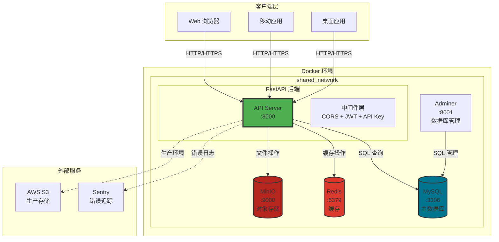
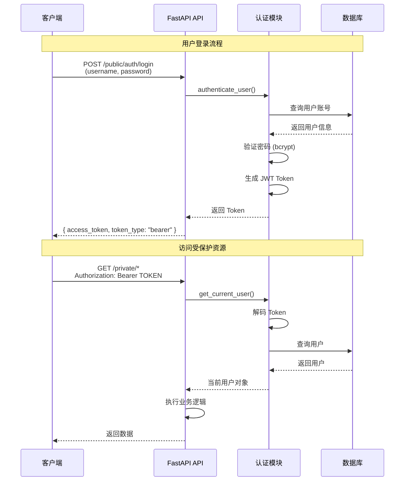
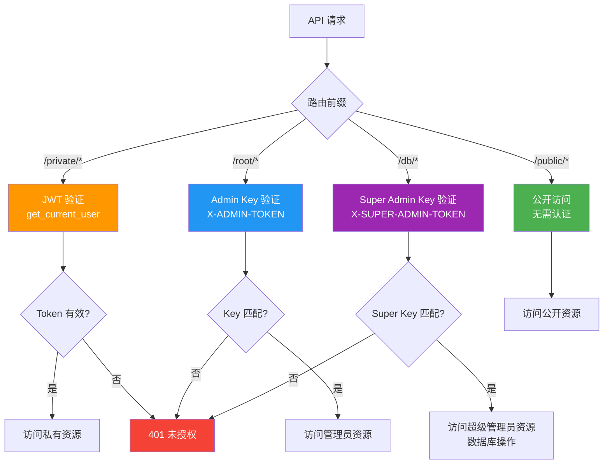
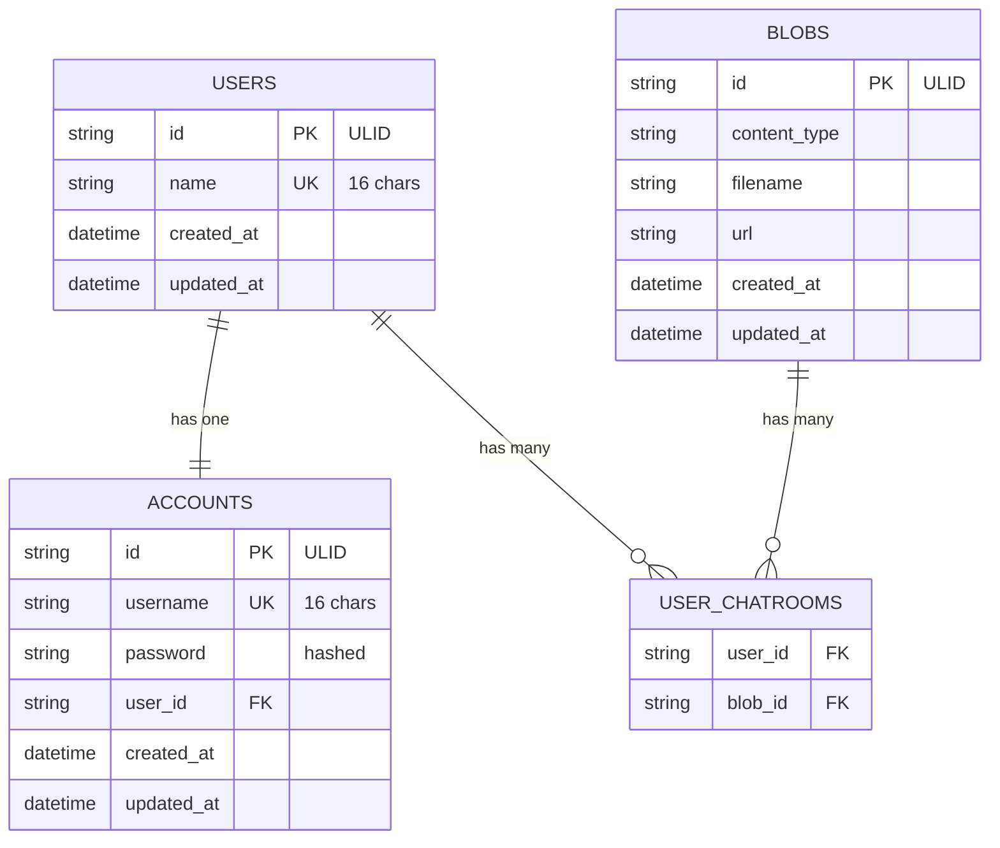
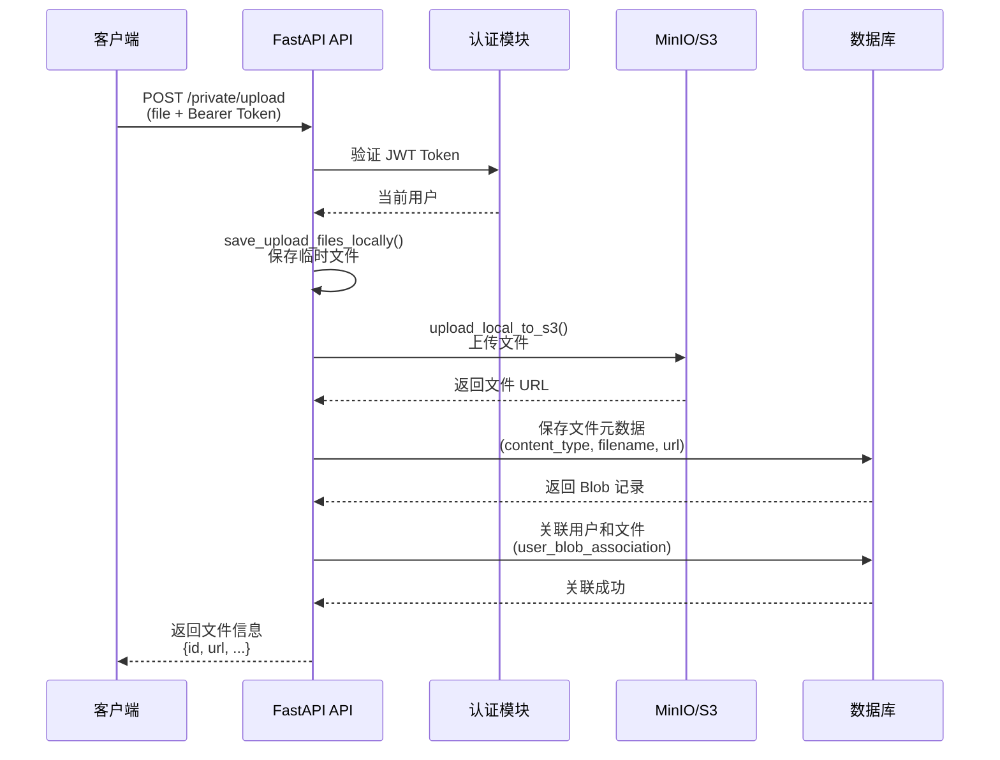
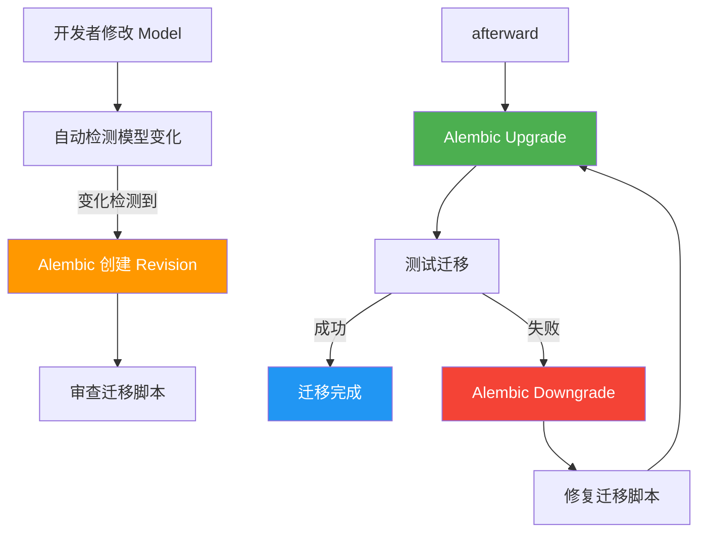
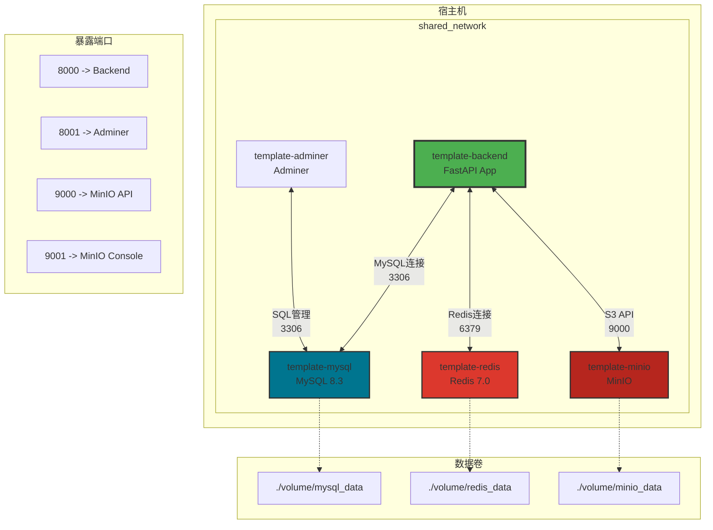
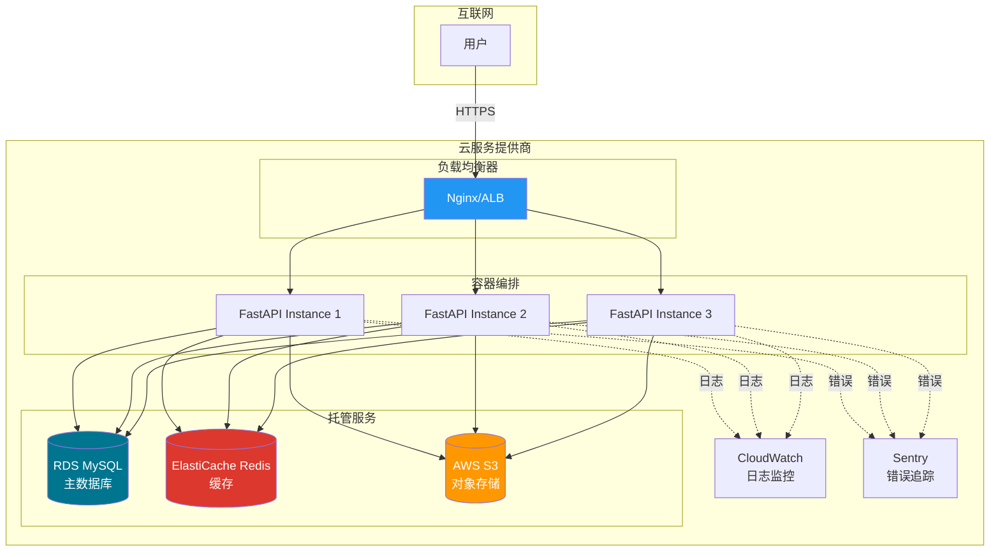
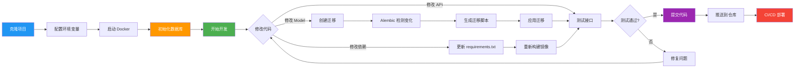

# 项目架构流程图（Mermaid）

> 本文迁移自仓库根目录的 ARCHITECTURE_DIAGRAMS.md。

## 使用方式
- 直接在支持 Mermaid 的 Markdown 渲染器中查看
- 或复制到 Mermaid Live Editor: https://mermaid.live/

---

## 1. 系统整体架构图



## 2. FastAPI 应用内部架构

```mermaid
graph LR
    subgraph Application[FastAPI 应用]
        subgraph Router[路由层]
            Public[/public/*<br/>公开路由]
            Private[/private/*<br/>私有路由]
            Root[/root/*<br/>管理员路由]
            DB[/db/*<br/>超级管理员路由]
        end
        
        subgraph Dependencies[依赖注入层]
            Auth[认证依赖<br/>JWT + API Key]
            Basic[基础依赖<br/>数据库会话]
        end
        
        subgraph Business[业务逻辑层]
            CRUD[CRUD 操作<br/>数据处理]
        end
        
        subgraph Schema[数据模式层]
            Models[Pydantic Models<br/>数据验证]
        end
        
        subgraph Database[数据库层]
            SQLAlchemy[SQLAlchemy ORM]
            MySQL[(MySQL Database)]
        end
    end
    
    Router --> Dependencies
    Dependencies --> Business
    Business --> Schema
    Schema --> SQLAlchemy
    SQLAlchemy --> MySQL
    
    style Router fill:#2196F3,color:#fff
    style Dependencies fill:#FF9800,color:#fff
    style Business fill:#9C27B0,color:#fff
    style Schema fill:#00BCD4,color:#fff
    style Database fill:#4CAF50,color:#fff
```

## 3. 认证与授权流程



## 4. 权限层级结构



## 5. 数据库模型关系图



## 6. 文件上传流程



## 7. 数据库迁移流程



## 8. Docker 容器网络架构



## 9. 部署架构 (生产环境)



## 10. 开发工作流程图


