# 项目架构流程图（Mermaid）

> 本文迁移自仓库根目录的 ARCHITECTURE_DIAGRAMS.md。

## 使用方式
- 直接在支持 Mermaid 的 Markdown 渲染器中查看
- 或复制到 Mermaid Live Editor: https://mermaid.live/
- 或查看下方已渲染的图片版本

> 💡 提示：图片已自动渲染，保存在 `docs/images/` 目录中。如需重新渲染，运行 `python3 render_diagrams.py`

---

## 1. 系统整体架构图

```mermaid
graph TB
    subgraph Client[客户端层]
        Web[Web 浏览器]
        Mobile[移动应用]
        Desktop[桌面应用]
    end
    
    subgraph Docker[Docker 环境]
        subgraph Network[shared_network]
            subgraph Backend[FastAPI 后端]
                API[API Server<br/>:8000]
                Middleware[中间件层<br/>CORS + JWT + API Key]
            end
            
            DB[(MySQL<br/>:3306<br/>主数据库)]
            Cache[(Redis<br/>:6379<br/>缓存)]
            Storage[(MinIO<br/>:9000<br/>对象存储)]
            Adminer[Adminer<br/>:8001<br/>数据库管理]
        end
    end
    
    subgraph External[外部服务]
        Sentry[Sentry<br/>错误追踪]
        AWS_S3[AWS S3<br/>生产存储]
    end
    
    Web -->|HTTP/HTTPS| API
    Mobile -->|HTTP/HTTPS| API
    Desktop -->|HTTP/HTTPS| API
    
    API -->|SQL 查询| DB
    API -->|缓存操作| Cache
    API -->|文件操作| Storage
    API -.->|错误日志| Sentry
    API -.->|生产环境| AWS_S3
    
    Adminer -->|SQL 管理| DB
    
    style API fill:#4CAF50,stroke:#333,stroke-width:3px
    style DB fill:#00758F,stroke:#333,stroke-width:2px
    style Cache fill:#DC382D,stroke:#333,stroke-width:2px
    style Storage fill:#B6261E,stroke:#333,stroke-width:2px
```




## 2. FastAPI 应用内部架构

```mermaid
graph LR
    subgraph Application[FastAPI 应用]
        subgraph Router[路由层]
            Public[/public/*<br/>公开路由]
            Private[/private/*<br/>私有路由]
            Root[/root/*<br/>管理员路由]
            DB[/db/*<br/>超级管理员路由]
        end
        
        subgraph Dependencies[依赖注入层]
            Auth[认证依赖<br/>JWT + API Key]
            Basic[基础依赖<br/>数据库会话]
        end
        
        subgraph Business[业务逻辑层]
            CRUD[CRUD 操作<br/>数据处理]
        end
        
        subgraph Schema[数据模式层]
            Models[Pydantic Models<br/>数据验证]
        end
        
        subgraph Database[数据库层]
            SQLAlchemy[SQLAlchemy ORM]
            MySQL[(MySQL Database)]
        end
    end
    
    Router --> Dependencies
    Dependencies --> Business
    Business --> Schema
    Schema --> SQLAlchemy
    SQLAlchemy --> MySQL
    
    style Router fill:#2196F3,color:#fff
    style Dependencies fill:#FF9800,color:#fff
    style Business fill:#9C27B0,color:#fff
    style Schema fill:#00BCD4,color:#fff
    style Database fill:#4CAF50,color:#fff
```


## 3. 认证与授权流程

```mermaid
sequenceDiagram
    participant Client as 客户端
    participant API as FastAPI API
    participant Auth as 认证模块
    participant DB as 数据库
    
    Note over Client,DB: 用户登录流程
    Client->>API: POST /public/auth/login<br/>(username, password)
    API->>Auth: authenticate_user()
    Auth->>DB: 查询用户账号
    DB-->>Auth: 返回用户信息
    Auth->>Auth: 验证密码 (bcrypt)
    Auth->>Auth: 生成 JWT Token
    Auth-->>API: 返回 Token
    API-->>Client: { access_token, token_type: "bearer" }
    
    Note over Client,DB: 访问受保护资源
    Client->>API: GET /private/*<br/>Authorization: Bearer TOKEN
    API->>Auth: get_current_user()
    Auth->>Auth: 解码 Token
    Auth->>DB: 查询用户
    DB-->>Auth: 返回用户
    Auth-->>API: 当前用户对象
    API->>API: 执行业务逻辑
    API-->>Client: 返回数据
```




## 4. 权限层级结构

```mermaid
graph TD
    Start[API 请求] --> Router{路由前缀}
    
    Router -->|/public/*| Public[公开访问<br/>无需认证]
    Router -->|/private/*| JWT[JWT 验证<br/>get_current_user]
    Router -->|/root/*| AdminKey[Admin Key 验证<br/>X-ADMIN-TOKEN]
    Router -->|/db/*| SuperKey[Super Admin Key 验证<br/>X-SUPER-ADMIN-TOKEN]
    
    JWT --> JWTVerify{Token 有效?}
    JWTVerify -->|是| PrivateAccess[访问私有资源]
    JWTVerify -->|否| Error401[401 未授权]
    
    AdminKey --> AdminVerify{Key 匹配?}
    AdminVerify -->|是| AdminAccess[访问管理员资源]
    AdminVerify -->|否| Error401
    
    SuperKey --> SuperVerify{Super Key 匹配?}
    SuperVerify -->|是| SuperAccess[访问超级管理员资源<br/>数据库操作]
    SuperVerify -->|否| Error401
    
    Public --> PublicAccess[访问公开资源]
    
    style Public fill:#4CAF50,color:#fff
    style JWT fill:#FF9800,color:#fff
    style AdminKey fill:#2196F3,color:#fff
    style SuperKey fill:#9C27B0,color:#fff
    style Error401 fill:#F44336,color:#fff
```




## 5. 数据库模型关系图


## 6. 文件上传流程

```mermaid
sequenceDiagram
    participant Client as 客户端
    participant API as FastAPI API
    participant Auth as 认证模块
    participant S3 as MinIO/S3
    participant DB as 数据库
    
    Client->>API: POST /private/upload<br/>(file + Bearer Token)
    API->>Auth: 验证 JWT Token
    Auth-->>API: 当前用户
    
    API->>API: save_upload_files_locally()<br/>保存临时文件
    API->>S3: upload_local_to_s3()<br/>上传文件
    S3-->>API: 返回文件 URL
    
    API->>DB: 保存文件元数据<br/>(content_type, filename, url)
    DB-->>API: 返回 Blob 记录
    
    API->>DB: 关联用户和文件<br/>(user_blob_association)
    DB-->>API: 关联成功
    
    API-->>Client: 返回文件信息<br/>{id, url, ...}
```




## 7. 数据库迁移流程

```mermaid
flowchart TD
    Start[开发者修改 Model] --> Detect[自动检测模型变化]
    Detect -->|变化检测到| CreateRevision[Alembic 创建 Revision]
    CreateRevision --> Review[审查迁移脚本]
    afterward --> Apply[Alembic Upgrade]
    Apply --> Test[测试迁移]
    Test -->|成功| Done[迁移完成]
    Test -->|失败| Rollback[Alembic Downgrade]
    Rollback --> Fix[修复迁移脚本]
    Fix --> Apply
    
    style CreateRevision fill:#FF9800,color:#fff
    style Apply fill:#4CAF50,color:#fff
    style Rollback fill:#F44336,color:#fff
    style Done fill:#2196F3,color:#fff
```




## 8. Docker 容器网络架构


## 9. 部署架构 (生产环境)

```mermaid
graph TB
    subgraph Internet[互联网]
        Users[用户]
    end
    
    subgraph Cloud[云服务提供商]
        subgraph LoadBalancer[负载均衡器]
            LB[Nginx/ALB]
        end
        
        subgraph ContainerOrchestrator[容器编排]
            direction TB
            App1[FastAPI Instance 1]
            App2[FastAPI Instance 2]
            App3[FastAPI Instance 3]
        end
        
        subgraph ManagedServices[托管服务]
            RDS[(RDS MySQL<br/>主数据库)]
            ElastiCache[(ElastiCache Redis<br/>缓存)]
            S3[(AWS S3<br/>对象存储)]
        end
        
        CloudWatch[CloudWatch<br/>日志监控]
        Sentry[Sentry<br/>错误追踪]
    end
    
    Users -->|HTTPS| LB
    LB --> App1
    LB --> App2
    LB --> App3
    
    App1 --> RDS
    App2 --> RDS
    App3 --> RDS
    
    App1 --> ElastiCache
    App2 --> ElastiCache
    App3 --> ElastiCache
    
    App1 --> S3
    App2 --> S3
    App3 --> S3
    
    App1 -.->|日志| CloudWatch
    App2 -.->|日志| CloudWatch
    App3 -.->|日志| CloudWatch
    
    App1 -.->|错误| Sentry
    App2 -.->|错误| Sentry
    App3 -.->|错误| Sentry
    
    style LB fill:#2196F3,color:#fff
    style RDS fill:#00758F,color:#fff
    style ElastiCache fill:#DC382D,color:#fff
    style S3 fill:#FF9800,color:#fff
```




## 10. 开发工作流程图

```mermaid
graph LR
    A[克隆项目] --> B[配置环境变量]
    B --> C[启动 Docker]
    C --> D[初始化数据库]
    D --> E[开始开发]
    
    E --> F{修改代码}
    F -->|修改 Model| G[创建迁移]
    F -->|修改 API| H[测试接口]
    F -->|修改依赖| I[更新 requirements.txt]
    
    G --> G1[Alembic 检测变化]
    G1 --> G2[生成迁移脚本]
    G2 --> G3[应用迁移]
    G3 --> H
    
    H --> J{测试通过?}
    J -->|是| K[提交代码]
    J -->|否| L[修复问题]
    L --> F
    
    I --> M[重新构建镜像]
    M --> H
    
    K --> N[推送到仓库]
    N --> O[CI/CD 部署]
    
    style A fill:#2196F3,color:#fff
    style D fill:#FF9800,color:#fff
    style E fill:#4CAF50,color:#fff
    style K fill:#9C27B0,color:#fff
    style O fill:#F44336,color:#fff
```




